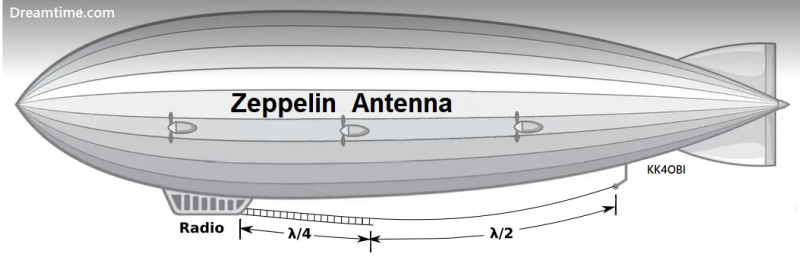

# Técnicas y Herramientas Modernas

_Carrera de Ingeniería en Mecatrónica_

**Profesor Titular Responsable de Cátedra**  
Ricardo Palma

---

## Diseño y construcción de una antena Zeppelin para recepción en 27,460 MHz

---

**Integrantes del grupo**  
Castel Francisco  
Ñuñez Brian  
Quiroga Juan Ignacio  
Sorrentino Nicolás

_Mendoza, Mayo 2025_

# Introducción

La banda de 11 metros (27 000--28 000 MHz) es popular en CB y radioafición por su combinación de cobertura regional y despliegue sencillo.
Entre las múltiples configuraciones HF, la antena Zeppelin---un radiador de media onda alimentado por el extremo mediante una línea de adaptación---destaca por no requerir radiales ni grandes planos de tierra.
En este proyecto se diseña y construye un prototipo casero optimizado para recepción en 27,460 MHz, empleando una línea bifilar de $\tfrac{1}{4}\,\lambda$ y un balun 1:1.

La caracterización de su adaptación de impedancia y ROE se realiza con un NanoVNA, cuyos resultados se analizan para evaluar el rendimiento y proponer mejoras futuras.

# Fundamento teórico

## ¿Qué es una antena?

Una antena es un dispositivo que permite la conversión entre señales eléctricas y ondas electromagnéticas propagadas en el espacio.
En transmisión, convierte corriente alterna de alta frecuencia en radiación; en recepción, capta ondas electromagnéticas y las convierte en señales eléctricas útiles.

Existen múltiples tipos de antenas, que varían en forma, tamaño y principios de funcionamiento, dependiendo de la frecuencia de operación y del propósito del sistema.
Entre los tipos más comunes se encuentran las antenas de hilo, dipolos, monopolos, antenas direccionales (como Yagi--Uda) y antenas de plano de tierra.

Las antenas resonantes, como el dipolo de media onda, tienen dimensiones que coinciden con una fracción específica de la longitud de onda ($\lambda$) de la señal, lo que permite una transferencia eficiente de energía con pérdidas mínimas.

## Principio de funcionamiento del dipolo de media onda

Un dipolo de media onda consiste en dos conductores lineales, cada uno de un cuarto de longitud de onda ($\tfrac{\lambda}{4}$), alimentados en el centro, con una longitud total de $\tfrac{\lambda}{2}$. A continuación se describen sus características principales:

- **Distribución de corriente:**
  La corriente máxima se encuentra en el centro del dipolo y disminuye de forma sinusoidal hasta hacerse cero en los extremos. Matemáticamente, en un dipolo de longitud $L=\tfrac{\lambda}{2}$ la corriente en un punto a distancia $x$ del centro se aproxima por
  $$I(x) = I_0 \,\sin\!\Bigl(\frac{\pi\,x}{L}\Bigr)\,, 
      \quad x\in\bigl[-\tfrac{L}{2},+\tfrac{L}{2}\bigr]\,.$$

- **Distribución de voltaje:**
  El voltaje alterno presenta un mínimo (nodo) en el centro y alcanza su valor máximo (antinode) en los extremos, cumpliendo la condición de circuito abierto allí.

- **Impedancia:**

  - En el *centro* del dipolo (punto de alimentación) la impedancia resistiva es baja, típicamente entre 50 y 75 $\Omega$ a resonancia.

  - En los *extremos* la impedancia es puramente resistiva y muy alta (miles de ohmios), debido a que la corriente se anula.

- **Resonancia:**
  Cuando la longitud total del dipolo coincide con $\tfrac{\lambda}{2}$, la antena está en resonancia y su reactancia es nula. En esa condición, la transferencia de energía entre el transmisor (o receptor) y la antena es óptima, y la relación de onda estacionaria (ROE) alcanza un mínimo.

- **Patrón de radiación:**
  El dipolo de media onda irradia principalmente en direcciones perpendiculares a su eje, con un diagrama de radiación en corte E típico de dos lóbulos simétricos y un mínimo de radiación en los extremos.

## Antena Zeppelin: origen, evolución y funcionamiento

La antena Zeppelin (o *end-fed Zepp*) es una variación del dipolo de media onda desarrollada a principios del siglo XX para las comunicaciones a bordo de los dirigibles Zeppelin. Permite desplegar un radiador largo sin necesidad de un gran plano de tierra ni radiales, maximizando el espacio y reduciendo interferencias con la estructura metálica del casco.

#### Historia y evolución

- **1909:** Beggerow instala el primer "Zepp" en el LZ3, usando un dipolo de $\tfrac{\lambda}{2}$ con línea de alimentación abierta de $\tfrac{\lambda}{2}$.

- **Décadas siguientes:** se simplifica a un stub de $\tfrac{\lambda}{4}$ y se introduce el balun 1:1 para mejorar adaptación a coaxial de 50 $\Omega$.

- **Actualidad:** radioaficionados usan versiones compactas y portátiles para HF y VHF, aprovechando la ligereza y facilidad de izado.

#### Detalles de construcción

1.  **Radiador ($\lambda/2$):**

    - Longitud física $\approx 0.94\,\times\tfrac{\lambda}{2}$ para compensar el factor de acortamiento del aislante.

    - Materiales típicos: tubo de aluminio, alambre de cobre esmaltado o cable aislado para exteriores.

2.  **Línea escalera ($\tfrac{\lambda}{4}$):**

    - Dos hilos de cobre, separados $\approx$`<!-- -->`{=html}20--30 mm, mantenidos con separadores de PVC cada 50--80 cm.

    - Impedancia característica $Z_0\approx300$--600 $\Omega$, según separación y diámetro.

    - Longitud física $\approx 0.97\,\times\tfrac{\lambda}{4}$ para línea aérea, o ajustada según VF del dieléctrico si es twin-lead de 300 $\Omega$.

3.  **Balun 1:1:**

    - Toroide de ferrita FT240-43 con 6--10 vueltas de coaxial o cable esmaltado.

    - Reduce corrientes de modo común y mejora el patrón de radiación.

#### Principio de adaptación de impedancia

Un stub de $\tfrac{\lambda}{4}$ invierte la impedancia de carga según:
$$Z_\text{in} \;=\;\frac{Z_0^2}{Z_L}\,,$$
donde $Z_L\gg Z_0$ (miles de ohmios en el extremo del radiador) y $Z_\text{in}\approx50\,\Omega$ en la base (punto de conexión del coaxial).

#### Variantes y consideraciones prácticas

- **J‐pole coaxial:** usa un trozo de coaxial con VF $\approx0.66$ como línea de adaptación, reduciendo el número de piezas mecánicas.

- **Zepp doble extendido:** radiador de $\approx1.25\,\lambda$ con alimentación central y línea afinada, para mayor ganancia.

- **Instalación:** altura mínima recomendada $\ge0.25\,\lambda$ sobre suelo; tensión mecánica y protección contra UV/oxidación.

# Fundamento teórico

## ¿Qué es una antena?

Una antena es un dispositivo que permite la conversión entre señales eléctricas y ondas electromagnéticas propagadas en el espacio.
En transmisión, convierte corriente alterna de alta frecuencia en radiación; en recepción, capta ondas electromagnéticas y las convierte en señales eléctricas útiles.

Existen múltiples tipos de antenas, que varían en forma, tamaño y principios de funcionamiento, dependiendo de la frecuencia de operación y del propósito del sistema.
Entre los tipos más comunes se encuentran las antenas de hilo, dipolos, monopolos, antenas direccionales (como Yagi--Uda) y antenas de plano de tierra.

Las antenas resonantes, como el dipolo de media onda, tienen dimensiones que coinciden con una fracción específica de la longitud de onda ($\lambda$) de la señal, lo que permite una transferencia eficiente de energía con pérdidas mínimas.

## Principio de funcionamiento del dipolo de media onda

Un dipolo de media onda consiste en dos conductores lineales, cada uno de un cuarto de longitud de onda ($\tfrac{\lambda}{4}$), alimentados en el centro, con una longitud total de $\tfrac{\lambda}{2}$. A continuación se describen sus características principales:

- **Distribución de corriente:**
  La corriente máxima se encuentra en el centro del dipolo y disminuye de forma sinusoidal hasta hacerse cero en los extremos. Matemáticamente, en un dipolo de longitud $L=\tfrac{\lambda}{2}$ la corriente en un punto a distancia $x$ del centro se aproxima por
  $$I(x) = I_0 \,\sin\!\Bigl(\frac{\pi\,x}{L}\Bigr)\,, 
      \quad x\in\bigl[-\tfrac{L}{2},+\tfrac{L}{2}\bigr]\,.$$

- **Distribución de voltaje:**
  El voltaje alterno presenta un mínimo (nodo) en el centro y alcanza su valor máximo (antinode) en los extremos, cumpliendo la condición de circuito abierto allí.

- **Impedancia:**

  - En el *centro* del dipolo (punto de alimentación) la impedancia resistiva es baja, típicamente entre 50 y 75 $\Omega$ a resonancia.

  - En los *extremos* la impedancia es puramente resistiva y muy alta (miles de ohmios), debido a que la corriente se anula.

- **Resonancia:**
  Cuando la longitud total del dipolo coincide con $\tfrac{\lambda}{2}$, la antena está en resonancia y su reactancia es nula. En esa condición, la transferencia de energía entre el transmisor (o receptor) y la antena es óptima, y la relación de onda estacionaria (ROE) alcanza un mínimo.

- **Patrón de radiación:**
  El dipolo de media onda irradia principalmente en direcciones perpendiculares a su eje, con un diagrama de radiación en corte E típico de dos lóbulos simétricos y un mínimo de radiación en los extremos.

## Antena Zeppelin: origen, evolución y funcionamiento

La antena Zeppelin (o *end-fed Zepp*) es una variación del dipolo de media onda desarrollada a principios del siglo XX para las comunicaciones a bordo de los dirigibles Zeppelin. Permite desplegar un radiador largo sin necesidad de un gran plano de tierra ni radiales, maximizando el espacio y reduciendo interferencias con la estructura metálica del casco.

#### Historia y evolución

- **1909:** Beggerow instala el primer "Zepp" en el LZ3, usando un dipolo de $\tfrac{\lambda}{2}$ con línea de alimentación abierta de $\tfrac{\lambda}{2}$.

- **Décadas siguientes:** se simplifica a un stub de $\tfrac{\lambda}{4}$ y se introduce el balun 1:1 para mejorar adaptación a coaxial de 50 $\Omega$.

- **Actualidad:** radioaficionados usan versiones compactas y portátiles para HF y VHF, aprovechando la ligereza y facilidad de izado.

#### Detalles de construcción

1.  **Radiador ($\lambda/2$):**

    - Longitud física $\approx 0.94\,\times\tfrac{\lambda}{2}$ para compensar el factor de acortamiento del aislante.

    - Materiales típicos: tubo de aluminio, alambre de cobre esmaltado o cable aislado para exteriores.

2.  **Línea escalera ($\tfrac{\lambda}{4}$):**

    - Dos hilos de cobre, separados $\approx$`<!-- -->`{=html}20--30 mm, mantenidos con separadores de PVC cada 50--80 cm.

    - Impedancia característica $Z_0\approx300$--600 $\Omega$, según separación y diámetro.

    - Longitud física $\approx 0.97\,\times\tfrac{\lambda}{4}$ para línea aérea, o ajustada según VF del dieléctrico si es twin-lead de 300 $\Omega$.

3.  **Balun 1:1:**

    - Toroide de ferrita FT240-43 con 6--10 vueltas de coaxial o cable esmaltado.

    - Reduce corrientes de modo común y mejora el patrón de radiación.

#### Principio de adaptación de impedancia

Un stub de $\tfrac{\lambda}{4}$ invierte la impedancia de carga según:
$$Z_\text{in} \;=\;\frac{Z_0^2}{Z_L}\,,$$
donde $Z_L\gg Z_0$ (miles de ohmios en el extremo del radiador) y $Z_\text{in}\approx50\,\Omega$ en la base (punto de conexión del coaxial).

#### Variantes y consideraciones prácticas

- **J‐pole coaxial:** usa un trozo de coaxial con VF $\approx0.66$ como línea de adaptación, reduciendo el número de piezas mecánicas.

- **Zepp doble extendido:** radiador de $\approx1.25\,\lambda$ con alimentación central y línea afinada, para mayor ganancia.

- **Instalación:** altura mínima recomendada $\ge0.25\,\lambda$ sobre suelo; tensión mecánica y protección contra UV/oxidación.

# Comparación con antena Moxon

La antena *Moxon* es un directorio de dos elementos (driven + reflector) basado en un dipolo plegado, muy popular en HF por su buena directividad y ancho de banda relativamente estrecho. A continuación se detallan sus diferencias y similitudes con la antena Zeppelin end-fed de media onda:

- **Tipo de antena:**

  - *Zeppelin $\tfrac{1}{2}\,\lambda$ end-fed:* radiador de media onda alimentado en un extremo mediante un stub de $\tfrac{1}{4}\,\lambda$.

  - *Moxon 2 $\times$ 0.5 $\lambda$ beam:* dos elementos de aproximadamente $0.5\,\lambda$ plegados, alimentados en el centro con balun 1:1.

- **Patrón de radiación:**

  - *Zeppelin:*

    - Polarización horizontal: bidireccional, lóbulos perpendiculares al alambre.

    - Polarización vertical: omnidireccional en el plano horizontal.

  - *Moxon:*

    - Un solo lóbulo principal con alta directividad.

    - Relación frontal/espalda típica $\gtrsim$`<!-- -->`{=html}10 dB.

- **Ganancia (espacio libre):**

  - Zeppelin: $\approx2.1\,$dBi.

  - Moxon: $\approx6\,$dBi.

- **Adaptación de impedancia:**

  - Zeppelin: requiere stub de $\tfrac{1}{4}\,\lambda$ o balun 1:1 para transformar varios k$\Omega$ a 50 $\Omega$.

  - Moxon: centroalimentada, balun 1:1 directo a una impedancia de 50--75 $\Omega$.

- **Ancho de banda:**

  - Zeppelin: moderado, cubre aproximadamente $\pm200\,$kHz en torno a 27.460 MHz con ROE \< 2:1 tras ajuste.

  - Moxon: más estrecho, del orden de $\pm100\,$kHz para ROE \< 1.5:1.

- **Complejidad mecánica:**

  - Zeppelin: muy sencillo (dos hilos más balun), sin necesidad de mástil central.

  - Moxon: requiere boom rígido y montaje preciso de separaciones entre elementos.

#### Resumen comparativo

|                       | Adaptación                                      | Plano de tierra | Montaje físico         |
|-----------------------|--------------------------------------------------|------------------|-------------------------|
| Zeppelin ½ $\lambda$  | stub $\tfrac{1}{4}\,\lambda$ → 50 $\Omega$      | No necesita      | Muy simple, end-fed     |
| Dipolo Moxon          | balun 1:1 → 50–75 $\Omega$                      | No necesita      | Boom rígido, preciso    |

En síntesis, la Moxon ofrece mayor ganancia y directividad, ideal para enlaces punto a punto o DX selectivo, a costa de mayor complejidad. La antena Zeppelin end-fed, en cambio, destaca por su simplicidad de construcción e instalación y por no requerir radiales ni mástil central, siendo adecuada para recepción general en 27.460 MHz.

# Diseño y construcción

## Materiales y herramientas

A continuación se listan los componentes y herramientas utilizadas en el prototipo:

- **Radiador y línea escalera:**
  Conductores de par trenzado UTP (cable RJ-45) usados tanto para el elemento radiante de $\tfrac{\lambda}{2}$ (aprox. 5,2 m) como para la línea bifilar de $\tfrac{\lambda}{4}$ (aprox. 2,2 m).

- **Balun 1:1:**
  Núcleo de ferrita de 20 mm de diámetro externo y 12 mm interno, equivalente al modelo `FT23-43`. Se enrollaron 8 espiras de cable esmaltado para formar el choke de corriente.

- **Conectores y fijaciones:**
  Tornillos y tuercas para sujetar conductores en la caja impresa en 3D, conector coaxial hembra en panel y conector macho para acoplar al receptor.

- **Herramientas:**
  soldador y estaño, pinzas y alicates, destornilladores, cúter, metro, taladro, impresora 3D y pistola de silicona caliente.

## Cálculo de dimensiones

Para afinar el prototipo a 27,460 MHz se consideran los siguientes cálculos:

1.  **Longitud de onda ($\lambda$):**
    $$\lambda = \frac{c}{f}
        = \frac{300\ \text{Mm/s}}{27{,}460\ \text{MHz}}
        \approx 10{,}92\ \text{m}.$$

2.  **Elemento radiante (½ $\lambda$):**\
    Con factor de acortamiento del aislante ($\approx0{,}94$):
    $$L_{\mathrm{rad}}
        = 0{,}94 \times \frac{\lambda}{2}
        \approx 0{,}94 \times 5{,}46\ \text{m}
        \approx 5{,}13\ \text{m}.$$

3.  **Stub de alimentación (¼ $\lambda$):**\
    Usando cable UTP con factor de velocidad $V_f\approx0{,}80$:
    $$L_{\mathrm{stub}}
        = V_f \times \frac{\lambda}{4}
        \approx 0{,}80 \times 2{,}73\ \text{m}
        \approx 2{,}18\ \text{m}.$$

Estos valores sirven como punto de partida: en la práctica se suele cortar ligeramente más largo y recortar gradualmente hasta situar el mínimo de ROE justo en 27,460 MHz."'

## Montaje paso a paso

1.  **Preparación del radiador:**
    Cortar 5,15 m de cable UTP, pelar los extremos y marcar los puntos de anclaje en aisladores.

2.  **Construcción de la línea bifilar:**
    Cortar 2,65 m de cable, imprimir separadores en 3D y montarlos cada 50 cm para mantener 20--30 mm de separación.

3.  **Ensamblaje del balun:**
    Enrollar 8 vueltas de cable esmaltado sobre el núcleo FT23-43 y fijar vivo y masa del coaxial con soldadura.

4.  **Conexión final:**
    Atornillar conductores de la línea al balun en la caja, montar el conector hembra y sellar con silicona caliente.

5.  **Izado e instalación:**
    Tensar el radiador en aisladores a la altura deseada, colgar la línea bifilar verticalmente y dirigir el coaxial al receptor.

## Montaje real

A continuación se presentan las fotografías del prototipo instalado, junto con una descripción detallada de cada componente y su función en el sistema:

En la Figura [7](#fig:foto_balun){reference-type="ref" reference="fig:foto_balun"} se aprecia el balun 1:1 alojado en una caja de ABS impresa en 3D. El núcleo de ferrita FT23-43, de 20 mm exterior y 12 mm interior, está completamente recubierto por el devanado de 8 espiras de cable esmaltado. El vivo (azul) y la malla (negro) del coaxial se soldaron directamente a las patillas del choke, garantizando una conexión mecánica firme y una baja inductancia parásita. La silicona caliente se empleó para sellar la unión y evitar que la vibración o la humedad alteren la adaptación de impedancia.

La Figura [8](#fig:foto_ladder){reference-type="ref" reference="fig:foto_ladder"} muestra el stub de alimentación: dos conductores de UTP riguroso separados mediante espaciadores impresos en 3D cada 50 cm. Estos separadores, de perfil rectangular, mantienen una distancia constante de 25 mm, asegurando una impedancia característica aproximada de 500  $\Omega$.Obsérvese cómo los extremos superiores de la escalera se han dejado aislados y doblados para evitar contacto accidental, y cómo el tramo inferior se dirige al balun con una curva suave que minimiza pérdidas por radio frecuencias.

En la Figura [9](#fig:foto_antena){reference-type="ref" reference="fig:foto_antena"} se observa el montaje completo en posición de trabajo. El radiador de media onda, cortado a 5,13 m y tensado entre dos aisladores, se extiende horizontalmente para maximizar el patrón de radiación bidireccional. La línea bifilar cuelga verticalmente desde el extremo de alimentación hasta la caja de conexiones, donde se ubica el balun. El conjunto se instaló a 4 m sobre el suelo, logrando un ángulo de radiación bajo, ideal para recepciones distantes. El coaxial de bajada, protegido con cinta autovulcanizante, desciende hacia la estación receptora sin torsiones ni doblajes bruscos, reduciendo acoplamientos indeseados.

# Análisis de resultados de medición

## Respuesta en frecuencia (S~11~)

El barrido de S~11~ mostrado en la Figura [10]presenta dos resonancias principales:

- En $\sim5\,$MHz, se observa un mínimo de ROE $\approx3:1$, indicando una adaptación moderada.

- En $\sim16\,$MHz, el ROE aumenta hasta $\approx7:1$, señal de desadaptación en esa banda.

- En la frecuencia objetivo (27,460 MHz) no aparece un mínimo pronunciado, lo que confirma que la antena está desplazada de la resonancia ideal para recepción en 27,46 MHz.

Estos resultados sugieren que la combinación actual de longitudes de radiador y stub lleva la resonancia principal fuera de 27,460 MHz.

## Diagrama de Smith

En el Diagrama de Smith (Figura [11]) se aprecia cómo la impedancia de entrada varía con la frecuencia:

1.  Arranca en la zona inductiva (parte superior izquierda del gráfico).

2.  Describe una vuelta completa, cruzando el círculo resistivo (punto de $\Re\{Z\}=R$ puro), donde la reactancia $\Im\{Z\}=0$.

3.  Continúa hacia la región capacitiva (parte inferior derecha).

El marcador amarillo señala la frecuencia de mínima reflexión (mínimo de ROE). Su posición ---fuera de 27,460 MHz--- confirma la necesidad de ajuste.

## Discusión

- La presencia de múltiples resonancias (5 MHz y 16 MHz) indica que la antena funciona como un dipolo largo, con armónicos y efectos de stub.

- Para desplazar el mínimo de ROE a 27,460 MHz, es imprescindible recortar el radiador o modificar la longitud del stub.

- El comportamiento en el Diagrama de Smith muestra un buen *Q* (curva cerrada y limpia), lo que demuestra que la antena tiene baja pérdida y buena capacidad de selección de banda.

- Una vez ajustadas las longitudes, conviene verificar de nuevo con el NanoVNA y repetir el procedimiento hasta centrar la resonancia en la frecuencia deseada.

# Conclusiones

El prototipo de antena Zeppelin end-fed de media onda ha demostrado un comportamiento resonante claro en HF, con dos mínimos de ROE en torno a 5 MHz y 16 MHz.
El análisis en el Diagrama de Smith revela una trayectoria limpia (inductiva → resistiva → capacitiva), indicando baja pérdida y buena selectividad de banda.
Sin embargo, la resonancia principal está desplazada respecto a la frecuencia objetivo de 27 460 kHz, por lo que la antena requiere un ajuste fino de la longitud del radiador o del stub para centrar el mínimo de ROE en la banda de 11 m.

En términos de montaje, el uso de cable UTP como radiador y línea bifilar, junto con un balun 1:1 en núcleo FT23-43, ha sido una solución económica y eficaz, viable para una instalación semipermanente o de laboratorio.

# Recomendaciones y futuras mejoras

- Realizar ajuste iterativo de la longitud del radiador y del stub hasta obtener ROE \< 1.5 en 27 460 kHz.

- Repetir la calibración Open--Short--Load del NanoVNA antes de cada medición para garantizar precisión.

- Explorar variantes de balun (ej. núcleo FT240-43, distinto número de espiras) para optimizar el patrón.

- Mejorar los separadores de la línea escalera (material UV-resistente) para uso en exterior.

- Añadir una base de tierra ligera o contrapeso ajustable si se quisiera convertir en configuración monopolo.

- Documentar el comportamiento en otras bandas (armónicos) para aplicaciones multibanda.
